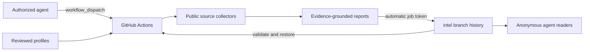

# GitHub-native agent research

The corrected root `spec.md` and its appended controller/scheduling task are the acceptance contract. PR #1 is merged; this implementation uses `feat/actions-mcp-schedules` and preserves PR #2's source registry. Scheduled and remote execution uses GitHub-hosted runners exclusively. Existing CLI, wizard, scrapers, deterministic fallback and local stdio MCP remain available for development.

## Controller and scheduling implementation — 2026-10-10 Europe/Berlin

- [x] Add 15 production MCP tools (39 total), approved remote profile discovery, bounded GitHub REST access through existing identity, explicit revision allowlists and safe error responses.
- [x] Dispatch with `return_run_details=true`; correlate 204 acknowledgements using opaque request IDs. Persist exclusive recovery reservations before POST; reconcile uncertain writes instead of blindly retrying. Bounded cross-client lookup and stable runner report IDs prevent duplicate archival findings.
- [x] Distinguish collection, runner and publication outcomes. Retrieve exact run/profile JSON, Markdown or evidence-preserving summary using commit-pinned identity, lengths and SHA-256 checks; never substitute latest.
- [x] Add schedule registry/schema/generator, strict profile/cron/time-zone/lookback/limit validation, native per-entry workflows, shared reusable collection/publication and CI drift checks. Migrate exactly five existing daily profiles; remove the old batch cron from the manual workflow.
- [x] Implement schedule creation/update/pause/resume/delete and source/profile proposals through reviewable PRs, with deterministic branch reuse, conflict checks, no force updates and no merge operation. Separate default-branch activation from pending proposals.
- [x] Preserve actual workflow/source/schedule/comparison provenance, immutable evidence and last-good behavior. Replay manual request IDs/native reruns without collecting or publishing duplicates. Unavailable nominal schedule timestamps remain null.
- [x] Document all controls, source editing and production boundaries in AGENTS.md, README, controller/schedule references, client example and exported tool schemas.
- [x] Local validation: **381 passed**, zero failures/skips (4.93 seconds); original configuration smoke passes; real stdio smoke passes with 39 tools/nine profiles; schedule/schema/generator checks pass with five entries; Ruff E9/F and Git whitespace checks pass.
- [x] All workflows pass actionlint through the documented narrow compatibility wrapper: v1.7.12 predates GitHub's documented `concurrency.queue=max`; the wrapper independently validates this field while retaining every other lint check. Native maximum queue prevents replacement of older pending daily jobs; up to 100 pending jobs remains a GitHub limit.
- [x] Live read of the previously published run `37995170028`: exact report `b1c39a7a56e644ed8e551659d97abec7`, publication `cffb24d93e0b13602e782cfd12f10b8965a5e227`, successful collection/publication and source revision `3de83ea8b819436ab9be078aed3e18ede6033c33` verified through the new controller.
- [x] Push integration branch, dispatch a new real Actions job through MCP, verify automatic-token publication and independent retrieval; actual IDs/results are recorded below.
- [ ] Open a new PR against main, preserving PR #2. Default-branch activation remains pending approval/merge; no future scheduled run has been claimed.

The new implementation deploys no Space, server or additional port. Until merge, main still executes the previously activated daily batch and lacks the new shared workflow/registry; default-branch schedule mutations correctly return `CONTROLLER_NOT_ACTIVATED`. The Berlin weekday example is a documented proposal, not an activated schedule. Exact control contracts and known idempotency/DST/delivery limits are in [mcp-controller.md](mcp-controller.md).

### Live controller verification

- Real stdio MCP discovered the nine approved profiles at `bbec220aba8854bfacac50b3c0fd27189f103f42`, then dispatched ECB/48 hours with request `controller-smoke-c70792da9059443b9110` on the explicitly allowlisted integration branch. GitHub returned HTTP 200 with actual run ID [38000215123](https://github.com/JsonLord/Horizon/actions/runs/38000215123). Repeating the request reused this ID; no second dispatch was made.
- Run completed successfully on 2026-10-09 at 22:38:28 UTC (2026-10-10 00:38:28 Berlin): collect 43 seconds, publish 12 seconds. GitHub accepted native `queue: max`. Publisher used only the automatically provided job token.
- Verified `intel` publication commit `93c38440da44f1ccdd3d0c2a7d1151a8266a9328`, introducing report `bd4595eddc2b1079e0b64429d8d450fa` under `intel/reports/institutions/ecb/2026/10/09/`. Exact JSON/Markdown/manifest links are [in the public snapshot](https://github.com/JsonLord/Horizon/tree/93c38440da44f1ccdd3d0c2a7d1151a8266a9328/intel/reports/institutions/ecb/2026/10/09/bd4595eddc2b1079e0b64429d8d450fa).
- Research is honestly `partial`: 23 findings/27 sources; Google News and the official ECB feed succeeded, GDELT returned HTTP 429. Historical comparison restored last-good report `b1c39a7a56e644ed8e551659d97abec7` from `cffb24d93e0b13602e782cfd12f10b8965a5e227` with validated prior checksum. Runner success/publication verification are distinct from coverage completeness.
- `hz_get_workflow_run` verified both jobs and actual publication; `hz_get_workflow_report` returned exact evidence-linked summary. A separate HTTP consumer without Authorization headers downloaded the pinned artifacts, checked run/request/source/previous-snapshot identity, verified both manifest lengths/SHA-256 and all finding evidence references. JSON: 76,560 bytes, SHA-256 `eeb28d6b1b5c5bd793c42500b3cf29ff0a94c3c945dc3128e71450c8d8edcc9c`; Markdown: 10,944 bytes.
- Initial CI run `38000183879` exposed the legacy smoke's dependency on ignored local config; fallback now uses the committed example in fresh checkouts. Run `38000261828` passed tests and both MCP checks, exposing ShellCheck's existing unquoted `$GITHUB_ENV` in daily-summary.yml; that redirection is now quoted and workflows pass with ShellCheck enabled locally. Final CI results will be recorded after the correction.



## Implementation checklist

- [x] Remove deployment API/dashboard, hosted token and direct FastAPI dependencies; restore legacy CLI Docker files.
- [x] Preserve native tools and nine reviewed profiles; remote inputs contain only approved profile ID and bounded lookback.
- [x] Restore prior archive from `intel` before collection, validate checksums, record previous commit/report/hash and workflow provenance.
- [x] Test independent fresh runners, stable IDs and unchanged/updated/new classifications.
- [x] Discover and validate ECB and CERN feeds, reject stock-photo noise, prioritize primary institutional sources.
- [x] Validate WHO feed and document stale entries; document absent Helmholtz RSS discovery and add reviewed official-domain searches.
- [x] Complete regression, MCP, actionlint and public archive validation; Docker build outcomes recorded below.
- [ ] Push updated branch and PR; genuine Actions execution remains subject to default-branch workflow availability.

## Agent playbook

Use existing GitHub authorization to submit a reviewed profile. No application-specific credential exists. A new target requires a reviewed profile PR; remote dispatch does not accept prompts, URLs, headers or commands.

```sh
gh workflow run horizon-intel.yml --repo JsonLord/Horizon \
  -f profile_id=institutions/ecb -f lookback_hours=48
gh run list --repo JsonLord/Horizon --workflow horizon-intel.yml \
  --event workflow_dispatch --json databaseId,status,conclusion,headSha,url,createdAt
gh run watch RUN_ID --repo JsonLord/Horizon --exit-status
gh run view RUN_ID --repo JsonLord/Horizon --json status,conclusion,jobs,headSha,url
gh run download RUN_ID --repo JsonLord/Horizon --name research-archive
```

Dispatch does not return a run ID synchronously. Capture the dispatch time, select the matching event/branch/head SHA from the run list, and verify the archived report's `workflow.run_id` equals the selected GitHub run ID. A local research job ID is not a durable remote job handle. The report's `workflow.source_commit` identifies the code; `history.previous_snapshot_commit` identifies the baseline. A Git commit cannot contain its own commit SHA; obtain the publication commit from the branch history and workflow publisher output.

Unauthenticated consumers read:

- https://raw.githubusercontent.com/JsonLord/Horizon/intel/intel/manifest.json
- https://raw.githubusercontent.com/JsonLord/Horizon/intel/intel/latest/world.json
- https://raw.githubusercontent.com/JsonLord/Horizon/intel/intel/latest/world.md
- https://raw.githubusercontent.com/JsonLord/Horizon/intel/intel/latest/institutions/ecb.json

Find the entry with matching `workflow.run_id` in the index; fetch its `path`, adjacent `manifest.json` and Markdown. Verify artifact byte counts and SHA-256. For consistent reads, replace `intel` in the URL with the publication commit SHA. Historical reports are under `intel/reports/<profile>/YYYY/MM/DD/<report-id>/`; institutional changes are in `intel/events/YYYY/MM/DD/events.jsonl`. Schemas are under `schemas/` on the archive branch.

## Runtime and safeguards

The workflow runs daily at 06:23 UTC or by authorized dispatch; GitHub schedules may be delayed and only run from the default branch. Collector permission is `contents: read`; only the publisher has `contents: write`, using automatic `GITHUB_TOKEN`. Both jobs use `ubuntu-latest`, Python 3.11 and frozen uv installation. Concurrency serializes publication, timeouts bound execution, artifacts expire after seven days, and the archive retains 100 reports and 30 event dates. Publication retries three non-force pushes and merges freshly fetched history to preserve concurrent reports.

A missing archive branch is explicit bootstrap. Existing corrupt/missing manifests or unavailable remote history stop collection rather than falsely reporting all prior stories as new. Restoration uses the newest nonempty successful/partial profile report, skips failed/empty snapshots, and records the baseline timestamp so stale last-good history remains visible. Partial source failure (including GDELT 503) remains a report limitation. Latest pointers are reconstructed from validated versioned reports, never trusted as the comparison source. Optional compatible-model inference accepts only evidence-linked selections; deterministic mode needs no keys.

Local stdio tools run with `uv run horizon-mcp`. They retain profile discovery, local research submission/status, public archive search and report retrieval plus all legacy stage tools. Local job state is for that process, not a GitHub runner queue. Remote control uses GitHub's own API/CLI; no HTTP endpoints or listening ports are part of this architecture.

## Verification record

In progress. Prior public archive commits were published using cloud Git authorization, not an Actions job token. They are useful readable evidence, but do not verify automatic-token publishing. The new workflow must be recognized on the default branch before dispatch can be genuinely validated; this task does not authorize merging PR #1.

### Source validation (2026-10-09)

ECB's official RSS directory `https://www.ecb.europa.eu/home/html/rss.en.html` links `https://www.ecb.europa.eu/rss/press.html`: HTTP 200, valid RSS, 15 entries. CERN's homepage advertises `https://home.cern/feed/`: HTTP 200, valid RSS, 10 entries with institutional news titles. WHO's `https://www.who.int/rss-feeds/news-english.xml` returns HTTP 200, self-identifies its official feed URL and parses 25 entries; observed 2024 entries are stale and excluded by the bounded lookback. Its publishing page exposes no feed link; the attempted generic RSS directory returns 404. These three validated URLs are in reviewed profiles, with official-domain search queries as complementary sources.

Helmholtz English and German newsrooms return HTTP 200, but neither exposes an RSS/Atom link. The site's robots file points to sitemaps, not feeds. `/en/rss/` and `/en/newsroom/rss/` return 404. No unverified feed is configured. Its reviewed `site:helmholtz.de` query and institutional-name queries remain functional public-source collection; primary sources rank before secondary mentions. This is a source availability limitation, not a credential requirement.

### Current validation

- Frozen installation succeeds with `uv sync --frozen --extra dev`.
- Final full regression suite: **318 passed**, zero failed/skipped (see `/tmp/horizon-regression-new.log` for the current-instance log). This includes six new history/provenance/quality tests, independent day-1/day-2/day-3 directories, a separate archive consumer, checksum rejection and an actual competing Git push.
- Both MCP smoke checks pass; real stdio transport lists 24 tools and nine profiles.
- `actionlint` passes for `horizon-intel.yml`; Docker Compose configuration validates.
- Real archive restore verifies three historical reports at commit `6f82103fabc30fae344d58fe18991882621727fb`. Anonymous manifest, world JSON/Markdown and ECB JSON reads return HTTP 200. These historical reports predate workflow provenance fields; new reports/index entries include them.
- Dispatch attempt returns HTTP 404 for `horizon-intel.yml`, which is not on the default branch. No genuine Actions run ID or automatic-token publication is claimed. No merge is performed.
- Docker normal build and host-network retry both fail DNS while fetching locked dependencies from `files.pythonhosted.org`; neither image build is claimed successful. Native frozen installation and CLI/MCP verification remain valid. Legacy `horizon --help` succeeds. The interactive wizard has no `--help` parser and reaches its existing prompt before EOF in this noninteractive check; its regression tests pass, and no wizard source was changed.

The cloud environment draft now contains frozen development installation and CLI/MCP/Actions instructions without a persistent service. Deployment-only domains were removed. Saving the draft does not publish the environment; review and publish it through environment settings when desired.

### Live fresh-output collection

A credential-free local development check restored the verified public archive and collected `institutions/ecb` with a 48-hour window. Report `6826e2dd61e4402bbd2aeca7f1fa8831` is partial with 23 findings/27 sources: 10 unchanged, two updated, 11 new. Google News official-domain and institutional queries plus RSS succeeded; GDELT returned HTTP 503. The report records prior report `65452eb59f454da3884b3e3583d57207`, SHA-256 `5450c4f49413e147d8d06f65414192c1d225262f3076c6ae1ceb62842dc90121`, baseline archive commit and stale-last-good=false. This local check is **not** an Actions run or newly published public result.

### Changed files

Removed `src/api/__init__.py`, `src/api/app.py`, `deploy/huggingface/README.md` and the HTTP-only `tests/test_research_http.py`. Added `src/research/history.py` and `tests/test_research_history.py`. Updated workflow, root spec, README, this record, legacy Dockerfile/Compose, dependency declaration/lockfile, four institution profiles, report schema, research analyzer/CLI/publisher/reporting/service and the registration fixture. Existing scrapers, model fallback, CLI/wizard, all 24 stdio MCP tools and public archive reader are retained.

Remaining acceptance blockers: genuine workflow dispatch/publication requires the workflow to exist on the default branch and Actions write permissions/branch policy to allow `intel` publication. Dispatch currently returns 404, so no real run IDs or conclusions exist for this new workflow. The updated PR stays unmerged. Helmholtz has no validated discoverable feed; public search coverage is explicitly limited. Legacy Docker image build is blocked by this environment's Docker DNS. No hosted deployment is planned.

## Activation completed

PR #1 was approved and squash-merged into `main` as `3de83ea8b819436ab9be078aed3e18ede6033c33`. Genuine workflow-dispatch run https://github.com/JsonLord/Horizon/actions/runs/37995170028 completed successfully: collector 51 seconds, publisher 14 seconds. Automatic-token publication created `intel` commit `cffb24d93e0b13602e782cfd12f10b8965a5e227`, whose parent is the prior verified archive commit. Report `b1c39a7a56e644ed8e551659d97abec7` records the exact workflow run ID and code SHA, prior report/hash/commit, and 23 findings/27 sources (10 unchanged, two updated, 11 new). A separate consumer validated the archive and anonymously read commit-pinned manifest, latest JSON/Markdown and versioned JSON. The report remains partial because GDELT failed, while Google News and RSS succeeded. The earlier default-branch/automatic-token blockers above describe the pre-activation state and are now resolved.

## Source registry and agent guide update

- Added root `AGENTS.md` with source/profile change instructions, the registry CLI, GitHub dispatch/poll/read steps, local MCP controls, actual parameter effects and limits, and review/verification expectations.
- Added `src/research/registry.py`, `sources/registry.json`, `schemas/source-registry.schema.json` and the `horizon-source` entry point. `add` discovers/validates public RSS/Atom, `list` inspects assignments, `remove` deletes a registered source, and `validate` checks effective profiles offline. New feeds remain reviewed repository changes rather than arbitrary remote inputs.
- Moved the existing Simon Willison source into the registry, preserving its name/topic/region and world/global assignment. Live registration observed valid RSS/Atom with 30 entries and latest publication 2026-10-09T15:02:29Z. No new monitored site was invented.
- Effective profile loading merges enabled registry feeds, rejects unknown/disabled assignments and combined feed-limit overflow, and deduplicates against inline/official feeds. Registered sources do not gain official-domain status automatically.
- Scheduled research now honors profile `max_items` above 60 instead of being silently limited by the local MCP request default. Local MCP retains its explicit depth limit.
- Collector RSS metrics include feed URL/name/error code, and RSS/search batches share a bounded collection budget so appended feeds are not discarded when searches fill it.
- New tests cover discovery, feed validation, private/query/credential URLs, cross-site discovery, approved assignments, atomic limit rejection, feed collection/attribution and full-search-budget retention. Final combined suite: **332 passed**, zero failures/skips (3.78 seconds). Both MCP checks pass (24 tools, nine profiles); Ruff E9/F, actionlint, registry CLI validation and registry JSON Schema validation pass. A live RSS-only ResearchService job collected six findings/sources through the registry-backed profile. URL-registry changes have not yet been merged or activated in production.
